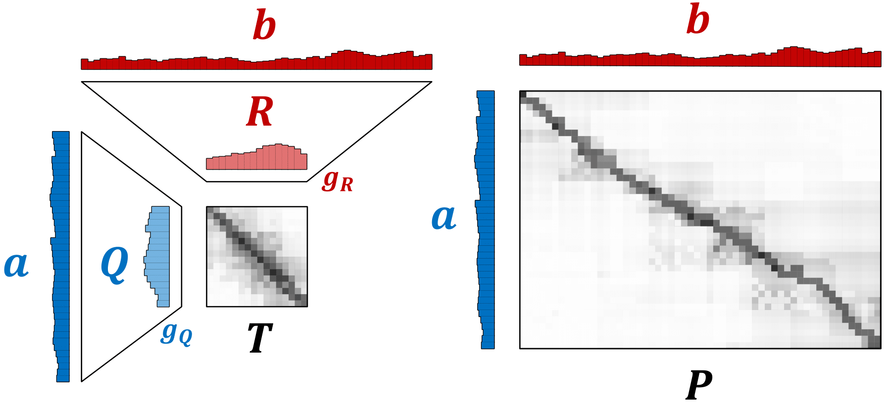

# FRLC

This is the repository for the paper <a href = "https://openreview.net/pdf?id=hGgkdFF2hR" > "Low-rank optimal transport through factor relaxation with latent coupling" </a> which computes an LC-factorization as an interpretable means of decomposing a coupling matrix for general OT costs (W, GW, FGW) and relaxations (balanced, semi-relaxed, and unbalanced).

<ol>
  <li> <tt>`FRLC.py`</tt> contains `FRLC_opt` and `FRLC_LR_opt` to run the FRLC algorithm and return a decomposed plan $(\mathbf{Q}, \mathbf{R}, \mathbf{T})$ </li>
  <li><tt>`FRLC_demo.ipynb</tt> is a demonstration notebook which shows users how to run the method, with plotting code in <tt>`plotting.py</tt>.</li>
  <li><tt>`objective_grad.py</tt> contain helper functions for the gradients of <tt>`FRLC.py`</tt></li>
  <li><tt>`util.py</tt> contains helper functions for <tt>`FRLC.py`</tt>, as well as <tt>`low_rank_distance_factorization`</tt> which can be used to compute an approximate factorization of the distance matrix, if it is too large to be computed or stored. </li>
</ol>



If you have any questions about how to run this method, encounter bugs, or have any feedback on it, feel free to send an email to ph3641@princeton.edu or open a GitHub discussion. If this algorithm has been helpful for your work, or has been relevant to your paper, also feel free to cite this work!

```
@inproceedings{
halmos2024lowrank,
title={Low-Rank Optimal Transport through Factor Relaxation with Latent Coupling},
author={Peter Halmos and Xinhao Liu and Julian Gold and Benjamin Raphael},
booktitle={The Thirty-eighth Annual Conference on Neural Information Processing Systems},
year={2024},
url={https://openreview.net/forum?id=hGgkdFF2hR}
}
```
Development of this repository is ongoing. The original files and experiments from the submission are also available on OpenReview for reproducibility.
