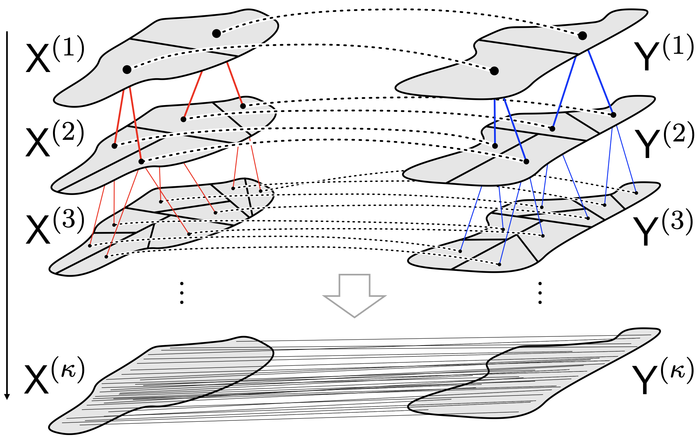

# Hierarchical Refinement (HiRef)

This is the repository for the paper **["Hierarchical Refinement: Optimal Transport to Infinity and Beyond,"](https://arxiv.org/pdf/2503.03025)** which scales optimal transport **linearly in space** and **log-linearly in time** by using a hierarchical strategy that constructs multiscale partitions from low-rank optimal transport.

In the section below, we detail the usage of Hierarchical Refinement which complements the simple example notebooks `refinement_demo_nb.ipynb` and `refinement_demo_nb_fast.ipynb`. We additionally detail how to call Hierarchical Refinement with acceleration, which we recommend using and intend to set as defaults in the future.



*Figure 1: Hierarchical Refinement algorithm: low-rank optimal transport is used to progressively refine partitions at the previous scale, with the coarsest scale partitions denoted* $X^{(1)}, Y^{(1)}$ *, and the finest scale partitions* $X^{(\kappa)}, Y^{(\kappa)}$ *corresponding to the individual points in the datasets.*

---

## **Usage**

**Hierarchical Refinement (HiRef)** only requires two **n×d** dimensional point clouds `X` and `Y` (**torch tensors**) as input.

Before running HiRef, call the **rank-annealing scheduler** to find a sequence of ranks that **minimizes the number of calls** to the low-rank optimal transport subroutine while remaining under a machine-specific maximal rank.

### **Rank Scheduler Parameters**
- `n` : The size of the dataset
- `hierarchy_depth (κ)` : The depth of the hierarchy of levels used in the refinement strategy
- `max_Q` : The maximal terminal rank at the base case
- `max_rank` : The maximal rank of the intermediate sub-problems

---

## **Getting Started**

### **1. Compute the Optimal Rank Schedule**
Import the **rank annealing** module and compute the rank schedule:

```python
import rank_annealing

rank_schedule = rank_annealing.optimal_rank_schedule(
    n=n, hierarchy_depth=hierarchy_depth, max_Q=max_Q, max_rank=max_rank
)
```

### **2. Initialize Hierarchical Refinement**
Import HR_OT and initialize the class using only the point clouds (you can additionally input the cost `C` if desired) along with any relevant parameters (e.g., **sq_Euclidean**) for your problem.
```python
import HR_OT
hrot = HR_OT.HierarchicalRefinementOT.init_from_point_clouds(
    X, Y, rank_schedule, base_rank=1, device=device
)
```
### **3. Run Hierarchical Refinement**
Run and return paired tuples from `X` and `Y` (the bijective Monge map between the datasets):

```python
Gamma_hrot = hrot.run(return_as_coupling=False)
```
### **4. Compute the OT primal cost**
To print the Optimal Transport (OT) cost, simply call:
```python
cost_hrot = hrot.compute_OT_cost()
print(f"Refinement Cost: {cost_hr_ot.item()}")
```

## Acceleration
One may accelerate Hierarchical Refinement in a number of ways. First, one may edit the solver parameters to place a ceiling on the number of iterations run, e.g. if speed is a more important factor than solution optimality. This can be done by lowering the `max_iter` and `max_inneriters` parameters from their default values. In addition, one may use a more lightweight low-rank OT solver (`src/LR_mini.LROT_LR_opt` for low-rank cost matrix and `src/LR_mini.LROT_opt` for full cost matrix) by simply passing the updated solvers to the initialization. All of these changes can be implemented with the following changes to the code above:

```python
import HR_OT
import LR_mini

solver_params = {
            'max_iter' : 15,
            'min_iter' : 10,
            'max_inneriters_balanced' : 60
        }
hrot_lr = HR_OT.HierarchicalRefinementOT.init_from_point_clouds(
                                                                X, Y,
                                                                rank_schedule, base_rank=1,
                                                                device=device,
                                                                solver_params=solver_params,
                                                                solver=LR_mini.LROT_LR_opt,
                                                                solver_full=LR_mini.LROT_opt
                                                            )
```
An implementation demonstrating this acceleration for squared Euclidean cost can be found in `refinement_demo_nb_fast.ipynb` for reference, with an example alignment of 2 x 200k points.

## Contact

For questions, discussions, or collaboration inquiries, feel free to reach out at [ph3641@princeton.edu](mailto:ph3641@princeton.edu) or [jg7090@princeton.edu](mailto:jg7090@princeton.edu).

## Reproducibility

While the default hyperparameter settings for HiRef have changed, the exact experiments and hyperparameter settings used are available on OpenReview. At the time of benchmarking, the default epsilon of Sinkhorn in ott-jax was 0.05, which has since been modified. Note that low-rank solvers such as LOT and FRLC are non-convex and use randomized initial conditions, so the solution of HiRef may exhibit slight variation between runs.

